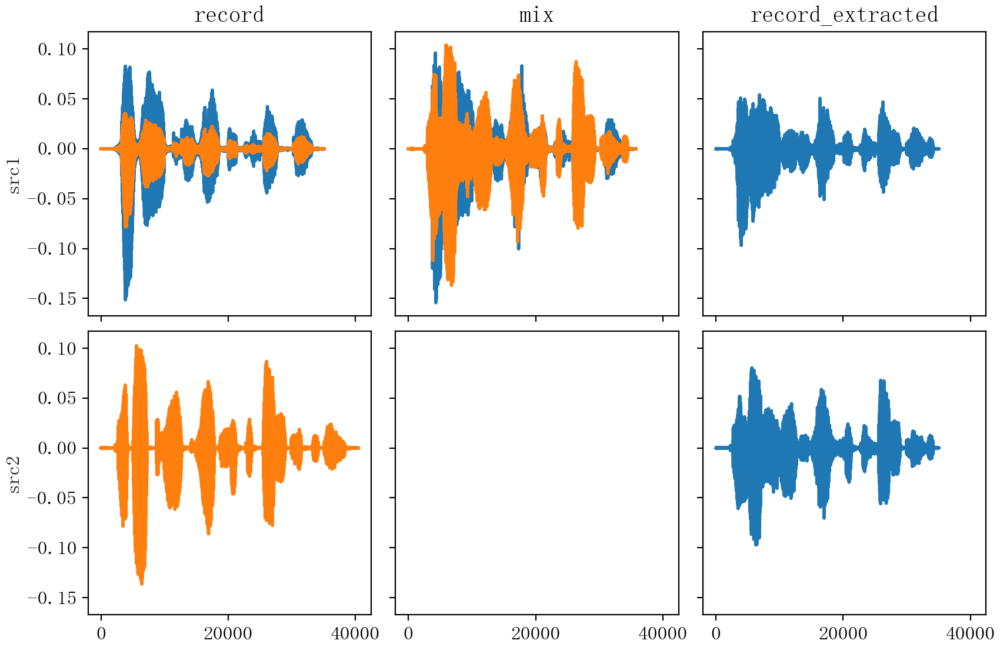
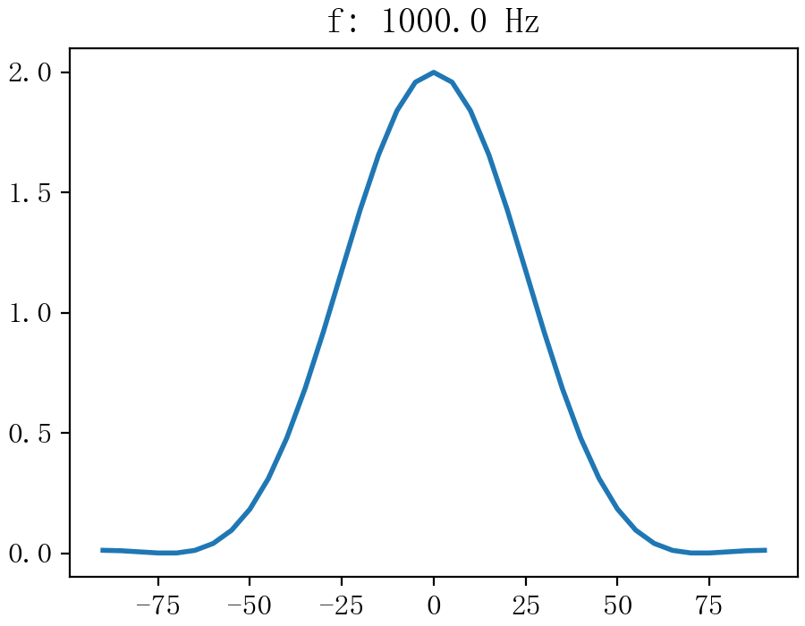
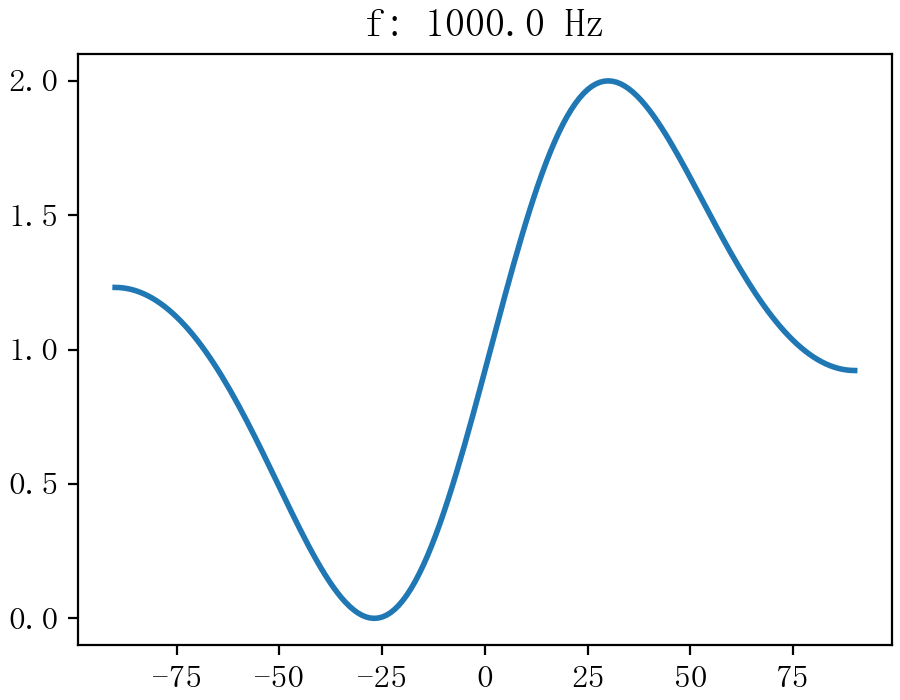
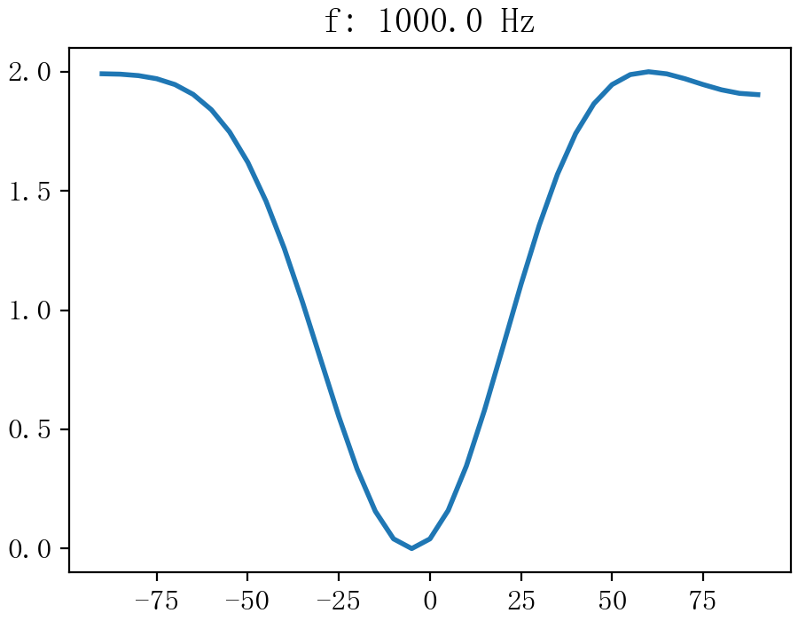
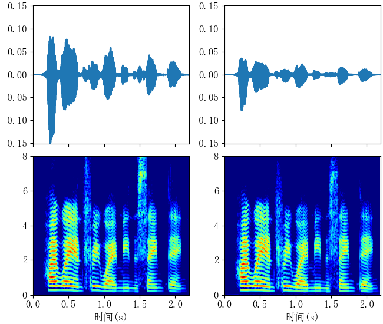
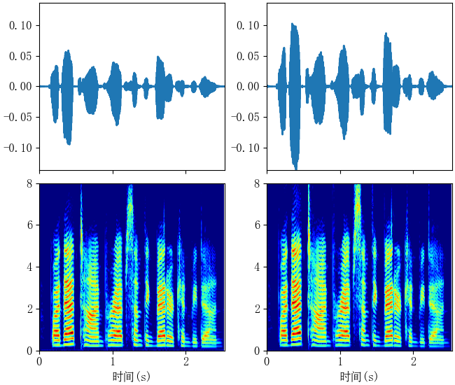
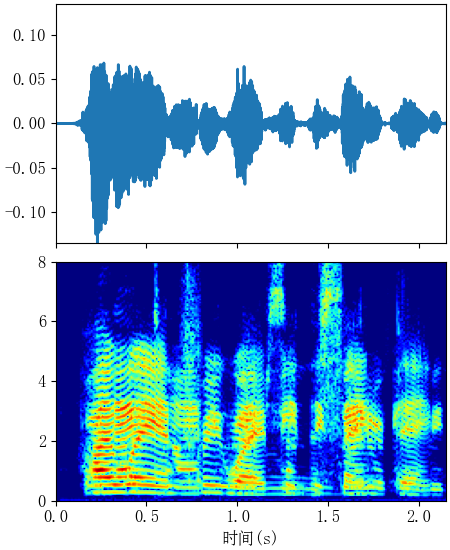
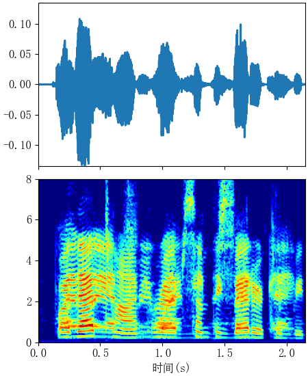
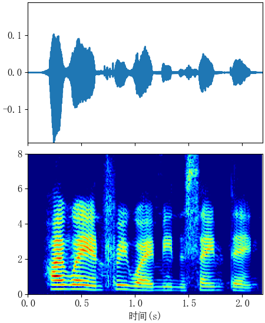

# MVDR beamfer

MVDR beamfer in python

e.g

````python
from BasicTools import wav_tools  # BasicTools is from my another repo, provide some basic functions
from BasicTools import plot_tools

# two spatialized sound, SNR=0
record_1, fs = wav_tools.read('Anechoic-snr_0-14_0.wav')
record_2, fs = wav_tools.read('Anechoic-snr_0-14_0_22.wav')
# mix
mix_len = np.min([record_1.shape[0], record_2.shape[0]])
mix = record_1[:mix_len, :]+record_2[:mix_len, :]
wav_tools.write(mix, fs, 'mix.wav')

mic_dist = [0, 0.18]  # distance(m) bewteen two adjacent mics, 0.18m is the diameter of head
frame_len = 320  #
frame_shift = 160
fs = 16000
mvdr = MVDR(mic_dist, frame_len, frame_shift, fs)
record_1_extracted = mvdr.filter(
    mix, -20, plot_spatial_rp=True,
    spatial_rp_path=f'record_1_extracted-{alpha1:.2e}-{alpha2:.2e}-spatial-rp.png')
record_2_extracted = mvdr.filter(
    mix, 20, plot_spatial_rp=True,
    spatial_rp_path=f'record_2_extracted-{alpha1:.2e}-{alpha2:.2e}-spatial-rp.png')

````

result



### Beam patten(1kHz)

|                           0                           |                           30                           | 60                                                     |
| :---------------------------------------------------: | :----------------------------------------------------: | ------------------------------------------------------ |
|  |  |  |

### Equations

For a microphone arrays with $K$ microphones, MVDR beamer coefficients are calculated as follow[1],

$$
h_c = \alpha_1\frac{\mathbf{R}^{-1}_{y_a,y_a}\mathbf{\alpha}}{\mathbf{\alpha}^T\mathbf{R}^{-1}_{y_a,y_a}\mathbf{\alpha}}
$$
where $\alpha_1$ is the attenuate factor due to propagation effects; $\mathbf{R}^{-1}_{y_a,y_a}$ is the correlation matrix of singals recorded by mics; $\mathbf{\alpha}$ is the steer vector,   
$$
\mathbf{\alpha} = Normalize([1, e^{-j\omega\tau_1}, \cdots, e^{-j\omega\tau_K-1}])
$$
$\tau_k$ is the delay of $k_{th} $channel relative to $1_{th}$ channel. 

Normally,  it is assumed that signal recorded by different mics only differed in times of arrival(TOAs). But for binaural sound, because of head shadow, there are interaural time difference(ITD) as well as interaural level difference(ILD), thus $\mathbf{\alpha}$ should be 
$$
\mathbf{\alpha} = Normalize([1, \alpha_{ild}e^{-j\omega\tau_{itd}}])
$$
Preliminary experiments show, much better result can be achieved using steer vector containing ITD and ILD 

e.g.

[mixture of two src]([src1_mvdr_output](examples\offline_with_steer_vector_dict/mix.wav))

|                  | src1                                                         | src2                                                         |
| ---------------- | ------------------------------------------------------------ | ------------------------------------------------------------ |
| before mixing    | [src1](examples/Anechoic-snr_0-14_0.wav) | [src2](examples/Anechoic-snr_0-14_0_22.wav) |
| MVDR without ILD | [src_mvdr_output](examples\offline_with_delay_dict/src1_enhanced-1.00e-06.wav)  | [src2_mvdr_output](examples\offline_with_delay_dict/src2_enhanced-1.00e-06.wav) |
| MVDR with ILD    | [src1_mvdr_output](examples\offline_with_steer_vector_dict/src1_enhanced-1.00e-06.wav) | [src2_mvdr_output](examples\offline_with_steer_vector_dict/src2_enhanced-1.00e-06.wav) |


 [1] Benesty, Jacob, Jingdong Chen, and Yiteng Huang. 2008. Microphone Array Signal Processing. Springer Topics in Signal Processing. Berlin Heidelberg: Springer-Verlag. https://doi.org/10.1007/978-3-540-78612-2.
